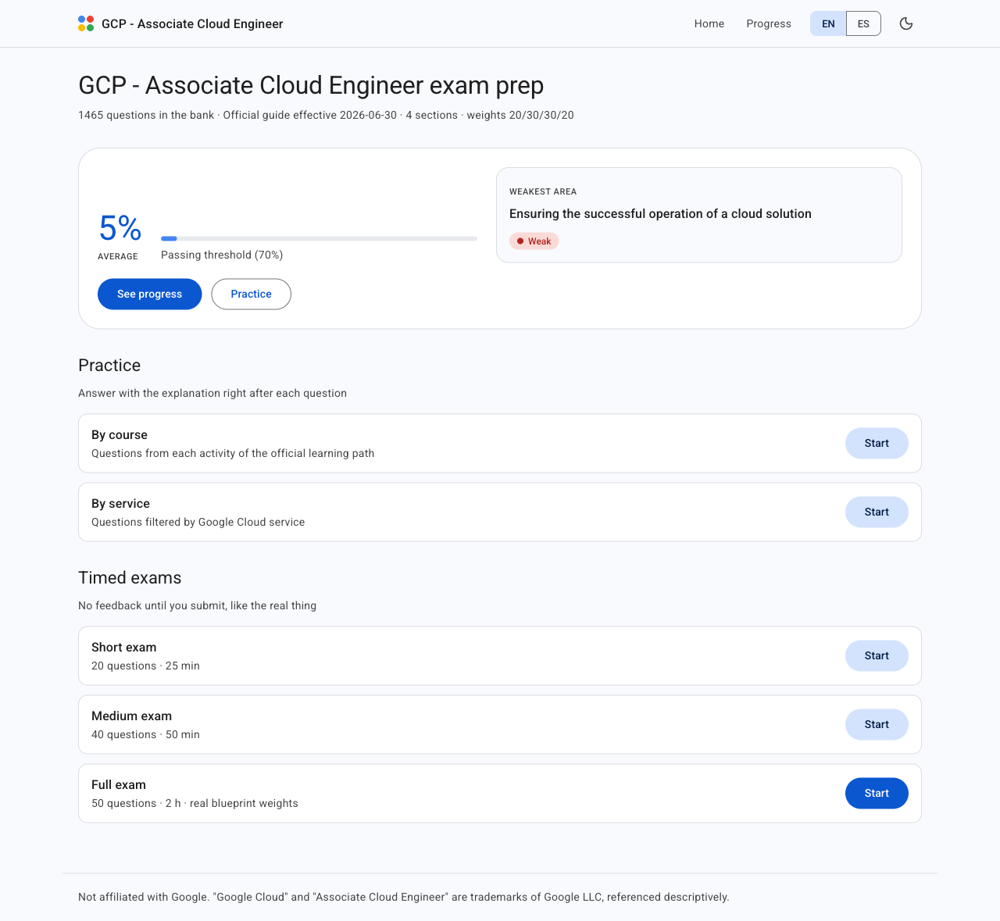

# Google Cloud Platform (GCP) - Associate Cloud Engineer — Certification Exam Prep


> [!IMPORTANT]
> **This is exam practice, not a course.** Everything here is built around
> **exam-style questions** for the **Google Cloud Associate Cloud Engineer**
> certification: 1,516 bilingual questions (English / Latin American Spanish),
> timed mock exams, and a progress dashboard that measures you against the
> official exam guide. You drill questions until the score says you are ready.



Everything runs on your machine. No accounts, no server, no telemetry — your
study history is a file on your disk.

> **Not affiliated with Google.** This is an independent study project.
> "Google Cloud" and "Associate Cloud Engineer" are trademarks of Google LLC,
> referenced here descriptively.

🇪🇸 [Léeme en español](README.es.md)

---

## What's inside

- **1,516 bilingual questions**, every one of them mapped to the official exam
  blueprint. Each question explains why the correct answer is correct **and why
  each distractor fails**, with a link to the official documentation.
- **100% blueprint coverage** — all 70 sub-topics of the guide effective
  **2026-06-30** (4 sections, weights 20/30/30/20).
- **Practice mode** by course (the 15 activities of the official learning path)
  or by Google Cloud service, with instant feedback.
- **Timed mock exams**: 20 questions / 25 min, 40 / 50 min, and a full 50 / 2 h
  that samples according to the real section weights.
- **Progress dashboard**: mastery by section, service and course, bank coverage,
  score history, and a recommended focus telling you what to study next.
- **English and Spanish** in the same question record — switch language at any
  time, mid-exam included.

## Requirements

**Python 3.10 or newer.** That's it.

You do *not* need to install Node, and you do *not* need to install a database
engine. Reflex downloads its own JavaScript runtime on first run, and the app
stores your history in SQLite, which ships inside Python's standard library.

## Getting started

```bash
git clone git@github.com:slackwero/google-GCP-associate-cloud-engineer-exam-prep.git
cd google-GCP-associate-cloud-engineer-exam-prep

./run.sh
```

Then open <http://localhost:3000>. Press `Ctrl+C` to stop the app.

That is the whole setup. The first time, `run.sh` creates an isolated Python
environment and installs the dependencies into it; every run after that it just
starts the app. It reinstalls by itself only when the dependencies change, and
it never touches the Python packages on the rest of your system.

Two things worth knowing:

- **The first run takes a while** (a minute or more). Reflex is downloading its
  JavaScript runtime and compiling the frontend. Later runs start quickly.
- **Internet is only needed to install.** Once set up, the app works offline:
  the question bank and the fonts are both in the repository.

The database is created automatically on first run. You start with an empty
history and the full question bank.

If the app is already running and ports 3000/8000 are busy, replace it with:

```bash
./run.sh --restart
```

`./run.sh --reinstall` rebuilds the environment from scratch, should it ever end
up in a broken state.

## What it covers

Every question is tagged with the exam section and sub-topic it belongs to, and
the bank is distributed to match the weights of the official guide — so a full
mock exam feels like the real thing rather than whatever was easiest to write.

| Exam section | Weight | Questions | Sub-topics |
|---|---|---|---|
| 1. Setting up a cloud solution environment | 20% | 213 | 11 |
| 2. Planning and implementing a cloud solution | 30% | 613 | 21 |
| 3. Ensuring the successful operation of a cloud solution | 30% | 471 | 29 |
| 4. Configuring access and security | 20% | 219 | 9 |
| **Total** | **100%** | **1,516** | **70** |

You can practise by exam topic, by course from the official learning path (15
activities), or by service. These are the 52 services and topic areas the bank
is indexed by:

**Compute and containers** — Compute Engine · Google Kubernetes Engine (GKE) ·
Cloud Run · Cloud Run functions · Persistent Disk / Hyperdisk · Artifact
Registry · kubectl / Kubernetes CLI · Helm · Eventarc

**Storage and data** — Cloud Storage · Cloud SQL · AlloyDB · Spanner ·
Firestore · Bigtable · BigQuery · Memorystore · Filestore / NetApp Volumes /
Managed Lustre · Dataflow · Pub/Sub · Managed Service for Apache Kafka ·
Storage Transfer Service · Database Center

**Networking** — VPC / Networking · Cloud Load Balancing · Cloud DNS · Cloud
NAT · Cloud NGFW / Firewall · Cloud VPN / Interconnect · Network Service Tiers

**Operations and observability** — Cloud Monitoring · Cloud Logging · Ops Agent
/ Managed Prometheus · Cloud Trace / Profiler / diagnostics · Active Assist /
Recommender · Cloud Hub / Service Health · Cloud Asset Inventory

**Identity and security** — IAM · Service accounts · Cloud Identity · Resource
hierarchy / Organization · Workforce / Workload Identity Federation · CMEK /
Cloud KMS

**Billing and governance** — Cloud Billing · APIs / Quotas

**AI and tooling** — Gemini Cloud Assist / Gemini CLI · Agent Runtime (Gemini
Enterprise Agent Platform) · GPUs / TPUs · Notebooks (Workbench / BigQuery) ·
Cloud Workstations · Terraform / IaC · gcloud CLI / Cloud Shell

A test in the suite fails if any sub-topic drops below five questions, so the
coverage above is enforced on every change rather than just claimed here.

## How your data is stored

| | Where | Tracked in git? |
|---|---|---|
| **Question bank, courses, services, blueprint** | JSON files in `quiz-app/data/` | Yes |
| **Your attempts and answers** | SQLite at `quiz-app/quiz_ace.db` | **No** |

Content is versioned like code: it is reviewed in diffs and validated by the
test suite. Your progress is yours and never leaves your machine — deleting
`quiz_ace.db` resets your history and nothing else.

## License

[MIT](LICENSE) — code and question bank alike. Use it, fork it, build on it,
including commercially; just keep the copyright notice.

The bundled Roboto font files are a separate matter: they are distributed under
the [Apache License 2.0](https://www.apache.org/licenses/LICENSE-2.0), as
documented in
[`quiz-app/assets/fonts/README.md`](quiz-app/assets/fonts/README.md).
